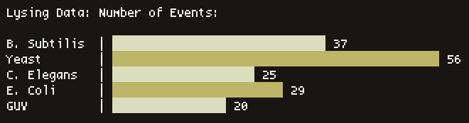

# hstgm
---



`hstgm` is a simple BASH/AWK script that produces a histogram plot in the
terminal from tab-delimited data. It scales with the terminal size and
label lengths.

### Usage

Input files must have the following tab-delimited structure:

```
TITLE

LABEL1    NUM
LABEL2    NUM
LABEL3    NUM
...
```


